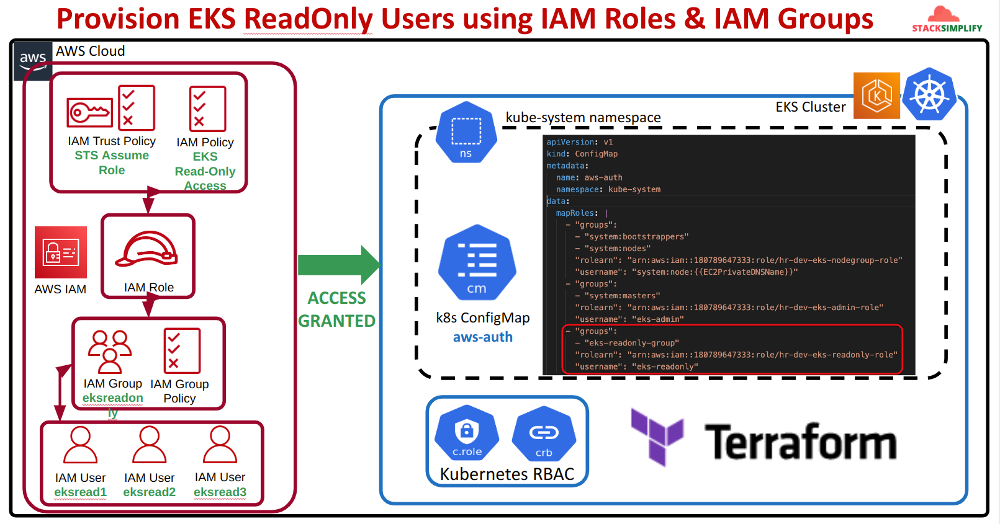
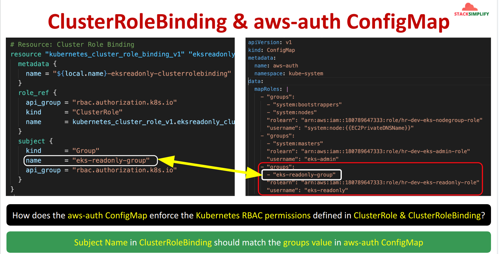

## I. Structure `EKS Readonly`

### 1. EKS ReadOnly User using IAM role & IAM group


### 2. Cluster RoleBinding and aws-auth ConfigMap


## II. Hand-on `EKS readonly` as `IAM roles` and `IAM group`

### Step-01: Provision `EKS cluster`
```powershell
terraform init

terraform validate

terraform plan

terraform apply
```
### Step-02: check `IAM groups`
```powershell

# List up IAM groups
aws iam list-groups

# Result
{
    "Groups": [
        {
            "Path": "/",
            "GroupName": "admin",
            "GroupId": "AGPATQHCR4OMZD4NA2RGK",
            "Arn": "arn:aws:iam::<account-id>:group/admin",
            "CreateDate": "2022-12-12T15:07:39+00:00"
        },
        {
            "Path": "/",
            "GroupName": "developer",
            "GroupId": "AGPATQHCR4OMZGQECSIQH",
            "Arn": "arn:aws:iam::<account-id>:group/developer",
            "CreateDate": "2023-01-03T15:37:22+00:00"
        },
        {
            "Path": "/",
            "GroupName": "eks-users-eks-admins",
            "GroupId": "AGPATQHCR4OM3KPHMURV6",
            "Arn": "arn:aws:iam::<account-id>:group/eks-users-eks-admins",
            "CreateDate": "2024-09-01T04:04:42+00:00"
        },
        {
            "Path": "/",
            "GroupName": "eks-users-eks-readonly",
            "GroupId": "AGPATQHCR4OM3RFCH6JZW",
            "Arn": "arn:aws:iam::<account-id>:group/eks-users-eks-readonly",
            "CreateDate": "2024-09-01T04:04:42+00:00"
        }
    ]
}

# List up users in group (GEt IAM group)
aws iam get-group --group-name eks-users-eks-readonly

# results:
{
    "Users": [
        {
            "Path": "/",
            "UserName": "eks-users-eks-readonly-user",
            "UserId": "AIDATQHCR4OMWPIYH3SHK",
            "Arn": "arn:aws:iam::<account-id>:user/eks-users-eks-readonly-user",
            "CreateDate": "2024-09-01T04:04:43+00:00"
        }
    ],
    "Group": {
        "Path": "/",
        "GroupName": "eks-users-eks-readonly",
        "GroupId": "AGPATQHCR4OM3RFCH6JZW",
        "Arn": "arn:aws:iam::<account-id>:group/eks-users-eks-readonly",
        "CreateDate": "2024-09-01T04:04:42+00:00"
    }
}
```

### Step-03: Create profile for user `eks-users-eks-readonly-user` which belong to `eks-users-eks-readonly` (on Step 02)
```powershell
aws iam create-access-key --user-name eks-users-eks-readonly-user

# access key response
{
    "AccessKey": {
        "UserName": "eks-users-eks-readonly-user",
        "AccessKeyId": "12345678",
        "Status": "Active",
        "SecretAccessKey": "12345678",
        "CreateDate": "2024-08-29T18:06:08+00:00"
    }
}

# config aws-cli profile
aws configure --profile eks-users-eks-readonly-user

# AWS Access Key ID [None]: 12345678
# AWS Secret Access Key [None]: 12345678
# Default region name [None]: ap-southeast-1
# Default output format [None]

# testing sts
aws sts get-caller-identity --profile eks-users-eks-readonly-user

# result
{
    "UserId": "AIDATQHCR4OMZR5UTUBJ5",
    "Account": "<account-id>",
    "Arn": "arn:aws:iam::<account-id>:user/eks-users-eks-readonly-user"
}
```

### Step-04: Get temporary Token, Access_Key, Secret_Key from `arn:aws:iam::<account-id>:role/study-dev-eks-cluster-eks-readonly-user-role` by using `aws sts` and `assume-role`
```powershell

# get temporary Token, Access_Key, Secret_Key
aws sts assume-role --profile eks-users-eks-readonly-user --role-arn "arn:aws:iam::<account-id>:role/study-dev-eks-cluster-eks-readonly-user-role" --role-session-name "EKS_READONLY_USER"

# Result:
{
    "Credentials": {
        "AccessKeyId": "RoleAccessKeyID",
        "SecretAccessKey": "RoleSecretKey",
        "SessionToken": "RoleSessionToken",
        "Expiration": "2024-08-31T10:36:29+00:00"
    },
    "AssumedRoleUser": {
        "AssumedRoleId": "AROATQHCR4OM6MCX3PLVO:EKS_READONLY_USER",
        "Arn": "arn:aws:sts::<account-id>:assumed-role/study-dev-eks-cluster-eks-readonly-user-role/EKS_READONLY_USER"
    }
}

# testing
export AWS_ACCESS_KEY_ID=RoleAccessKeyID
export AWS_SECRET_ACCESS_KEY=RoleSecretKey
export AWS_SESSION_TOKEN=RoleSessionToken

# check which user aws-cli using
aws sts get-caller-identity

# Result
{
    "UserId": "AROATQHCR4OM6MCX3PLVO:EKS_READONLY_USER",
    "Account": "<account-id>",
    "Arn": "arn:aws:sts::<account-id>:assumed-role/study-dev-eks-cluster-eks-readonly-user-role/EKS_READONLY_USER"
}
```

### step-05: update `kube-config` file
```powershell
# command
aws eks --region <region-code> update-kubeconfig --name <cluster_name> --profile <AWS-CLI-PROFILE-NAME>

# example
aws eks --region ap-southeast-1 update-kubeconfig --name study-dev-eks-cluster
```

### step-06: check `aws-auth` and kubernetes resources (Must using `EKS admin`)
```powershell
# check `aws-auth`
k get configmap aws-auth -n kube-system -o yaml

# result:
apiVersion: v1
data:
  mapRoles: |
    - "groups":
      - "system:bootstrappers"
      - "system:nodes"
      "rolearn": "arn:aws:iam::<account-id>:role/study-dev-eks-cluster-eks-node-group-role"
      "username": "system:node:{{EC2PrivateDNSName}}"
    - "groups":
      - "system:masters"
      "rolearn": "arn:aws:iam::<account-id>:role/study-dev-eks-cluster-eks-admin-user-role"
      "username": "iam-role-as-eks-admin"
    - "groups":
      - "readonly-group"
      "rolearn": "arn:aws:iam::<account-id>:role/study-dev-eks-cluster-eks-readonly-user-role"
      "username": "iam-role-as-eks-readonly"
  mapUsers: |
    - "groups":
      - "system:masters"
      "userarn": "arn:aws:iam::<account-id>:user/eks-users-basic-user"
      "username": "eks-users-basic-user"
    - "groups":
      - "system:masters"
      "userarn": "arn:aws:iam::<account-id>:user/eks-users-admin-user"
      "username": "eks-users-admin-user"
    - "userarn": "arn:aws:iam::<account-id>:user/eks-users-iam-read-only-user"
      "username": "eks-users-iam-read-only-user"
      "groups":
      - "readonly-user"
immutable: false
kind: ConfigMap
metadata:
  creationTimestamp: "2024-09-01T04:04:45Z"
  name: aws-auth
  namespace: kube-system
  resourceVersion: "8411"
  uid: 6adfe455-d143-4f53-92d9-830938ed939a
```

### step-07: check  `role`, `role-binding` and kubernetes resources (Must using `EKS admin`)
```powershell
# command:
k get roles,rolebinding

# result
NAME                                               CREATED AT
role.rbac.authorization.k8s.io/eks-readonly-role   2024-09-01T09:29:44Z

NAME                                                                                    ROLE                     AGE
rolebinding.rbac.authorization.k8s.io/study-dev-eks-cluster-eks-readonly-role-binding   Role/eks-readonly-role   22m

### Step-08: checking create Kubernetes resource (Using `EKS readonly user`)

#### Step-08-01: check create pod
```powershell
# Testing create pod:
k run nginx-admin3-pod --image=nginx

# Result:
Error from server (Forbidden): pods is forbidden: User "iam-role-as-eks-readonly" cannot create resource "pods" in API group "" in the namespace "default"

# List pods
k get pods

# Result:
NAME               READY   STATUS    RESTARTS   AGE
nginx-admin2-pod   1/1     Running   0          38m
nginx1-pod         1/1     Running   0          41
```

#### Step-08-02: checking get `clusterroles`, `clusterrolebindings`, `roles`, `rolebinding`
```powershell
# command:
k get clusterroles,clusterrolebindings,roles,rolebinding

# Result
Error from server (Forbidden): clusterroles.rbac.authorization.k8s.io is forbidden: User "iam-role-as-eks-readonly" cannot list resource "clusterroles" in API group "rbac.authorization.k8s.io" at the cluster scope

Error from server (Forbidden): clusterrolebindings.rbac.authorization.k8s.io is forbidden: User "iam-role-as-eks-readonly" cannot list resource "clusterrolebindings" in API group "rbac.authorization.k8s.io" at the cluster scope

Error from server (Forbidden): roles.rbac.authorization.k8s.io is forbidden: User "iam-role-as-eks-readonly" cannot list resource "roles" in API group "rbac.authorization.k8s.io" in the namespace "default"

Error from server (Forbidden): rolebindings.rbac.authorization.k8s.io is forbidden: User "iam-role-as-eks-readonly" cannot list resource "rolebindings" in API group "rbac.authorization.k8s.io" in the namespace "default"
```

## III. Hand-on `EKS readonly` as `IAM User (readonly access)`

### Step-01: Access EKS Cluster with `eks-users-iam-read-only-user` user (AWS IAM Admin User)
#### Step-01-01: Set Credentials for eks-users-iam-read-only-user user
```powershell
# Create Security Credentials for IAM User and make a note of them
aws iam create-access-key --user-name eks-users-iam-read-only-user
```

#### Step-01-02: Configure eks-users-iam-read-only-user user AWS CLI Profile
```powershell
# To list all configuration data
aws configure list

# To list all your profile names
aws configure list-profiles

# Configure aws cli eks-users-iam-read-only-user Profile
aws configure --profile eks-users-iam-read-only-user

# To list all your profile names
aws configure list-profiles
```  

#### Step-01-03: Access EKS Resources using kubectl
```powershell
# Clean-Up kubeconfig
>$HOME/.kube/config
cat $HOME/.kube/config

# Configure kubeconfig for kubectl with AWS CLI Profile eks-users-iam-read-only-user
aws eks --region <region-code> update-kubeconfig --name <cluster_name> --profile <AWS-CLI-PROFILE-NAME>

# command
aws eks --region ap-southeast-1 update-kubeconfig --name study-dev-eks-cluster --profile eks-users-iam-read-only-user

# Observation:
1. It should pass

# Verify kubeconfig
cat $HOME/.kube/config
      env:
      - name: AWS_PROFILE
        value: eks-users-iam-read-only-user

# Observation: At the end of kubeconfig file we find that AWS_PROFILE it is using is "eks-users-iam-read-only-user" profile
```

### Step-02: Check eks resource with IAM user `eks-users-iam-read-only-user`

#### Step-02-01: Check get `pod` (using user `eks-users-iam-read-only-user`)
```powershell
# List pods
k get pods

# Result:
NAME               READY   STATUS    RESTARTS   AGE
nginx-admin2-pod   1/1     Running   0          38m
nginx1-pod         1/1     Running   0          41
```

#### Step-02-02: Check get `clusterroles`, `clusterrolebindings`, `roles`, `rolebinding` (using user `eks-users-iam-read-only-user`)
```powershell
# command:
k get clusterroles,clusterrolebindings,roles,rolebinding

# result:
Error from server (Forbidden): clusterroles.rbac.authorization.k8s.io is forbidden: User "iam-user-as-eks-readonly" cannot list resource "clusterroles" in API group "rbac.authorization.k8s.io" at the cluster scope
Error from server (Forbidden): clusterrolebindings.rbac.authorization.k8s.io is forbidden: User "iam-user-as-eks-readonly" cannot list resource "clusterrolebindings" in API group "rbac.authorization.k8s.io" at the cluster scope
Error from server (Forbidden): roles.rbac.authorization.k8s.io is forbidden: User "iam-user-as-eks-readonly" cannot list resource "roles" in API group "rbac.authorization.k8s.io" in the namespace "default"
Error from server (Forbidden): rolebindings.rbac.authorization.k8s.io is forbidden: User "iam-user-as-eks-readonly" cannot list resource "rolebindings" in API group "rbac.authorization.k8s.io" in the namespace "default"
```

#### Step-02-03: Check get `deployment` (using user `eks-users-iam-read-only-user`)
```powershell
# command:
k get deployment

# result:
Error from server (Forbidden): deployments.apps is forbidden: User "iam-user-as-eks-readonly" cannot list resource "deployments" in API group "apps" in the namespace "default"
➜  eks git:(terraform-eks-user-using-aws-iam-role-and-group) ✗
```
